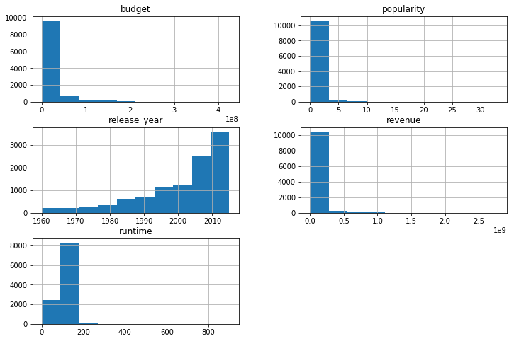

## Project: Investigate a Dataset (TMDb_Movies Dataset)
Table of Contents

   1) Introduction
   
   2) Data Wrangling
   
   3) Exploratory Data Analysis
   
   4) Conclusions


<a id='intro'></a>
## Introduction

 ## Overview

To complete my Data Analysis project I choose TMDb movies dataset.

This data set contains information about 10000 movies collected from The Movie Database (TMDb), including user ratings,popularity and revenue. It consist of 21 columns such as imdb_id, cast, budget, vote_count,runtime etc.It also have a lot of information because it has 10866 rows so my analysis will be base on a supset of data that contains the needed data points for that study.  
Question that can analyised from this data set

  1) What is the net profit per movie ?.
  
  2) Which year has the most gained profit?.
  
  3) Which movie has the highest gained revenue ?.
  
  4) Which movie has the lowest revenue ?.
  
  5) Most frequent actors
  
  6) Top 5 movies that have the highest revenues.
  
  7) Which geners are associated with the highest profits?.
  
  8) Most frequent movies.
  
  9) Which geners are popular?.
  
  10) Average runtime of all the movies and does time has an effect on the revenue?.

  
  

  

    
  
  
  


```python
#import important libraries that will help me with my analysis
import numpy as np
import pandas as pd
import matplotlib.pyplot as plt
import seaborn as sns 
%matplotlib inline
```

<a id='wrangling'></a>
## Data Wrangling

In this section after observing TMDb movie data , i will start to clean it to make the data easy to read and to understand the calculation.
### General Properties


```python
# first i need to look at TMDb data 
#loading csv file and storing it as df
df=pd.read_csv('TMDb_movie.csv')
df.head()
```


<div>
<style scoped>
    .dataframe tbody tr th:only-of-type {
        vertical-align: middle;
    }

    .dataframe tbody tr th {
        vertical-align: top;
    }

    .dataframe thead th {
        text-align: right;
    }
</style>
<table border="1" class="dataframe">
  <thead>
    <tr style="text-align: right;">
      <th></th>
      <th>id</th>
      <th>imdb_id</th>
      <th>popularity</th>
      <th>budget</th>
      <th>revenue</th>
      <th>original_title</th>
      <th>cast</th>
      <th>homepage</th>
      <th>director</th>
      <th>tagline</th>
      <th>...</th>
      <th>overview</th>
      <th>runtime</th>
      <th>genres</th>
      <th>production_companies</th>
      <th>release_date</th>
      <th>vote_count</th>
      <th>vote_average</th>
      <th>release_year</th>
      <th>budget_adj</th>
      <th>revenue_adj</th>
    </tr>
  </thead>
  <tbody>
    <tr>
      <th>0</th>
      <td>135397</td>
      <td>tt0369610</td>
      <td>32.985763</td>
      <td>150000000</td>
      <td>1513528810</td>
      <td>Jurassic World</td>
      <td>Chris Pratt|Bryce Dallas Howard|Irrfan Khan|Vi...</td>
      <td>http://www.jurassicworld.com/</td>
      <td>Colin Trevorrow</td>
      <td>The park is open.</td>
      <td>...</td>
      <td>Twenty-two years after the events of Jurassic ...</td>
      <td>124</td>
      <td>Action|Adventure|Science Fiction|Thriller</td>
      <td>Universal Studios|Amblin Entertainment|Legenda...</td>
      <td>6/9/2015</td>
      <td>5562</td>
      <td>6.5</td>
      <td>2015</td>
      <td>137999939.3</td>
      <td>1.392446e+09</td>
    </tr>
    <tr>
      <th>1</th>
      <td>76341</td>
      <td>tt1392190</td>
      <td>28.419936</td>
      <td>150000000</td>
      <td>378436354</td>
      <td>Mad Max: Fury Road</td>
      <td>Tom Hardy|Charlize Theron|Hugh Keays-Byrne|Nic...</td>
      <td>http://www.madmaxmovie.com/</td>
      <td>George Miller</td>
      <td>What a Lovely Day.</td>
      <td>...</td>
      <td>An apocalyptic story set in the furthest reach...</td>
      <td>120</td>
      <td>Action|Adventure|Science Fiction|Thriller</td>
      <td>Village Roadshow Pictures|Kennedy Miller Produ...</td>
      <td>5/13/2015</td>
      <td>6185</td>
      <td>7.1</td>
      <td>2015</td>
      <td>137999939.3</td>
      <td>3.481613e+08</td>
    </tr>
    <tr>
      <th>2</th>
      <td>262500</td>
      <td>tt2908446</td>
      <td>13.112507</td>
      <td>110000000</td>
      <td>295238201</td>
      <td>Insurgent</td>
      <td>Shailene Woodley|Theo James|Kate Winslet|Ansel...</td>
      <td>http://www.thedivergentseries.movie/#insurgent</td>
      <td>Robert Schwentke</td>
      <td>One Choice Can Destroy You</td>
      <td>...</td>
      <td>Beatrice Prior must confront her inner demons ...</td>
      <td>119</td>
      <td>Adventure|Science Fiction|Thriller</td>
      <td>Summit Entertainment|Mandeville Films|Red Wago...</td>
      <td>3/18/2015</td>
      <td>2480</td>
      <td>6.3</td>
      <td>2015</td>
      <td>101199955.5</td>
      <td>2.716190e+08</td>
    </tr>
    <tr>
      <th>3</th>
      <td>140607</td>
      <td>tt2488496</td>
      <td>11.173104</td>
      <td>200000000</td>
      <td>2068178225</td>
      <td>Star Wars: The Force Awakens</td>
      <td>Harrison Ford|Mark Hamill|Carrie Fisher|Adam D...</td>
      <td>http://www.starwars.com/films/star-wars-episod...</td>
      <td>J.J. Abrams</td>
      <td>Every generation has a story.</td>
      <td>...</td>
      <td>Thirty years after defeating the Galactic Empi...</td>
      <td>136</td>
      <td>Action|Adventure|Science Fiction|Fantasy</td>
      <td>Lucasfilm|Truenorth Productions|Bad Robot</td>
      <td>12/15/2015</td>
      <td>5292</td>
      <td>7.5</td>
      <td>2015</td>
      <td>183999919.0</td>
      <td>1.902723e+09</td>
    </tr>
    <tr>
      <th>4</th>
      <td>168259</td>
      <td>tt2820852</td>
      <td>9.335014</td>
      <td>190000000</td>
      <td>1506249360</td>
      <td>Furious 7</td>
      <td>Vin Diesel|Paul Walker|Jason Statham|Michelle ...</td>
      <td>http://www.furious7.com/</td>
      <td>James Wan</td>
      <td>Vengeance Hits Home</td>
      <td>...</td>
      <td>Deckard Shaw seeks revenge against Dominic Tor...</td>
      <td>137</td>
      <td>Action|Crime|Thriller</td>
      <td>Universal Pictures|Original Film|Media Rights ...</td>
      <td>4/1/2015</td>
      <td>2947</td>
      <td>7.3</td>
      <td>2015</td>
      <td>174799923.1</td>
      <td>1.385749e+09</td>
    </tr>
  </tbody>
</table>
<p>5 rows × 21 columns</p>
</div>


```python
#here i want to know the numbers of columns and rows
df.shape
```


    (10866, 21)


## Data Cleaning  
1) Removing the columns that won't be useful in my analysis.

2) There are numbers of movies in the database have zero budget or zero revenue,we will discard these movies because they won't be useful.

3) Finding datas that Nan value and then remove them.

4) Removing the duplicacy in the rows(if any).

5) Convert different data types into the same type such as "converting floats to integers".

6) Changing release date column into date format.

7) Changing format of genres and cast in order to use the in comparison with numerical data.


 


```python
# dropping columns that i won't use for.
#columns that i want to delete are 'id','imdb_id','homepage','tagline','production_companies','keywords','director','overview','vote_count','vote_average'
df.drop(['id','imdb_id','homepage','tagline','production_companies','keywords','director','overview','vote_count','vote_average'],axis= 1, inplace=True)
```


```python
# to confirm that the columns have been deleted
df.head(1)
```


<div>
<style scoped>
    .dataframe tbody tr th:only-of-type {
        vertical-align: middle;
    }

    .dataframe tbody tr th {
        vertical-align: top;
    }

    .dataframe thead th {
        text-align: right;
    }
</style>
<table border="1" class="dataframe">
  <thead>
    <tr style="text-align: right;">
      <th></th>
      <th>popularity</th>
      <th>budget</th>
      <th>revenue</th>
      <th>original_title</th>
      <th>cast</th>
      <th>runtime</th>
      <th>genres</th>
      <th>release_date</th>
      <th>release_year</th>
      <th>budget_adj</th>
      <th>revenue_adj</th>
    </tr>
  </thead>
  <tbody>
    <tr>
      <th>0</th>
      <td>32.985763</td>
      <td>150000000</td>
      <td>1513528810</td>
      <td>Jurassic World</td>
      <td>Chris Pratt|Bryce Dallas Howard|Irrfan Khan|Vi...</td>
      <td>124</td>
      <td>Action|Adventure|Science Fiction|Thriller</td>
      <td>6/9/2015</td>
      <td>2015</td>
      <td>137999939.3</td>
      <td>1.392446e+09</td>
    </tr>
  </tbody>
</table>
</div>


```python
#here i want to see some statistics to help me in my analysis
df.describe()
```


<div>
<style scoped>
    .dataframe tbody tr th:only-of-type {
        vertical-align: middle;
    }

    .dataframe tbody tr th {
        vertical-align: top;
    }

    .dataframe thead th {
        text-align: right;
    }
</style>
<table border="1" class="dataframe">
  <thead>
    <tr style="text-align: right;">
      <th></th>
      <th>popularity</th>
      <th>budget</th>
      <th>revenue</th>
      <th>runtime</th>
      <th>release_year</th>
      <th>budget_adj</th>
      <th>revenue_adj</th>
    </tr>
  </thead>
  <tbody>
    <tr>
      <th>count</th>
      <td>10866.000000</td>
      <td>1.086600e+04</td>
      <td>1.086600e+04</td>
      <td>10866.000000</td>
      <td>10866.000000</td>
      <td>1.086600e+04</td>
      <td>1.086600e+04</td>
    </tr>
    <tr>
      <th>mean</th>
      <td>0.646441</td>
      <td>1.462570e+07</td>
      <td>3.982332e+07</td>
      <td>102.070863</td>
      <td>2001.322658</td>
      <td>1.755104e+07</td>
      <td>5.136436e+07</td>
    </tr>
    <tr>
      <th>std</th>
      <td>1.000185</td>
      <td>3.091321e+07</td>
      <td>1.170035e+08</td>
      <td>31.381405</td>
      <td>12.812941</td>
      <td>3.430616e+07</td>
      <td>1.446325e+08</td>
    </tr>
    <tr>
      <th>min</th>
      <td>0.000065</td>
      <td>0.000000e+00</td>
      <td>0.000000e+00</td>
      <td>0.000000</td>
      <td>1960.000000</td>
      <td>0.000000e+00</td>
      <td>0.000000e+00</td>
    </tr>
    <tr>
      <th>25%</th>
      <td>0.207583</td>
      <td>0.000000e+00</td>
      <td>0.000000e+00</td>
      <td>90.000000</td>
      <td>1995.000000</td>
      <td>0.000000e+00</td>
      <td>0.000000e+00</td>
    </tr>
    <tr>
      <th>50%</th>
      <td>0.383856</td>
      <td>0.000000e+00</td>
      <td>0.000000e+00</td>
      <td>99.000000</td>
      <td>2006.000000</td>
      <td>0.000000e+00</td>
      <td>0.000000e+00</td>
    </tr>
    <tr>
      <th>75%</th>
      <td>0.713817</td>
      <td>1.500000e+07</td>
      <td>2.400000e+07</td>
      <td>111.000000</td>
      <td>2011.000000</td>
      <td>2.085325e+07</td>
      <td>3.369710e+07</td>
    </tr>
    <tr>
      <th>max</th>
      <td>32.985763</td>
      <td>4.250000e+08</td>
      <td>2.781506e+09</td>
      <td>900.000000</td>
      <td>2015.000000</td>
      <td>4.250000e+08</td>
      <td>2.827124e+09</td>
    </tr>
  </tbody>
</table>
</div>


```python
## my observation from the step above that i need to drop budgrt_adj and revenue_adj columns because there datas are similar to budget and revenue columns
df.drop(['budget_adj','revenue_adj'],axis=1,inplace=True)
df.head(1)
```


<div>
<style scoped>
    .dataframe tbody tr th:only-of-type {
        vertical-align: middle;
    }

    .dataframe tbody tr th {
        vertical-align: top;
    }

    .dataframe thead th {
        text-align: right;
    }
</style>
<table border="1" class="dataframe">
  <thead>
    <tr style="text-align: right;">
      <th></th>
      <th>popularity</th>
      <th>budget</th>
      <th>revenue</th>
      <th>original_title</th>
      <th>cast</th>
      <th>runtime</th>
      <th>genres</th>
      <th>release_date</th>
      <th>release_year</th>
    </tr>
  </thead>
  <tbody>
    <tr>
      <th>0</th>
      <td>32.985763</td>
      <td>150000000</td>
      <td>1513528810</td>
      <td>Jurassic World</td>
      <td>Chris Pratt|Bryce Dallas Howard|Irrfan Khan|Vi...</td>
      <td>124</td>
      <td>Action|Adventure|Science Fiction|Thriller</td>
      <td>6/9/2015</td>
      <td>2015</td>
    </tr>
  </tbody>
</table>
</div>


```python
# let us visualize our data after we cleaned it.
df.hist(figsize=(12,8));
```





```python
#to know the types of our data in order to see if we need further cleaning.
df.info()
```

    <class 'pandas.core.frame.DataFrame'>
    RangeIndex: 10866 entries, 0 to 10865
    Data columns (total 9 columns):
    popularity        10866 non-null float64
    budget            10866 non-null int64
    revenue           10866 non-null int64
    original_title    10866 non-null object
    cast              10790 non-null object
    runtime           10866 non-null int64
    genres            10843 non-null object
    release_date      10866 non-null object
    release_year      10866 non-null int64
    dtypes: float64(1), int64(4), object(4)
    memory usage: 764.1+ KB


```python
#There are numbers of movies in the database have zero budget or zero revenue,we will discard these movies because they won't be useful.
money=['budget', 'revenue']

#this will replace all the value from '0' to NAN in the money
df[money] = df[money].replace(0, np.NAN)

#Removing all the row which has NaN value in money 
df.dropna(subset = money, inplace = True)

rows, col = df.shape
print(' removing these values, we now have only {} no.of movies.'.format(rows-1))
```

     removing these values, we now have only 3854 no.of movies.


```python
#here we need to find the unuseful values like Nan.
df[df.cast.isnull()]

```


<div>
<style scoped>
    .dataframe tbody tr th:only-of-type {
        vertical-align: middle;
    }

    .dataframe tbody tr th {
        vertical-align: top;
    }

    .dataframe thead th {
        text-align: right;
    }
</style>
<table border="1" class="dataframe">
  <thead>
    <tr style="text-align: right;">
      <th></th>
      <th>popularity</th>
      <th>budget</th>
      <th>revenue</th>
      <th>original_title</th>
      <th>cast</th>
      <th>runtime</th>
      <th>genres</th>
      <th>release_date</th>
      <th>release_year</th>
    </tr>
  </thead>
  <tbody>
    <tr>
      <th>4127</th>
      <td>0.193929</td>
      <td>3000000.0</td>
      <td>13308.0</td>
      <td>Naqoyqatsi</td>
      <td>NaN</td>
      <td>89</td>
      <td>Documentary|Drama|Music|Thriller</td>
      <td>9/2/2002</td>
      <td>2002</td>
    </tr>
    <tr>
      <th>4889</th>
      <td>0.075043</td>
      <td>2500000.0</td>
      <td>33400000.0</td>
      <td>2016: Obama's America</td>
      <td>NaN</td>
      <td>87</td>
      <td>Documentary</td>
      <td>7/13/2012</td>
      <td>2012</td>
    </tr>
    <tr>
      <th>7813</th>
      <td>0.065543</td>
      <td>6000.0</td>
      <td>6000.0</td>
      <td>Loose Change: Final Cut</td>
      <td>NaN</td>
      <td>129</td>
      <td>Documentary</td>
      <td>11/11/2007</td>
      <td>2007</td>
    </tr>
    <tr>
      <th>9564</th>
      <td>0.168545</td>
      <td>2500000.0</td>
      <td>589244.0</td>
      <td>Powaqqatsi</td>
      <td>NaN</td>
      <td>99</td>
      <td>Documentary|Drama|Music</td>
      <td>4/29/1988</td>
      <td>1988</td>
    </tr>
  </tbody>
</table>
</div>


```python
#then we drop these values.
df.dropna(inplace=True)
```


```python
#to confirm the step above we need to see information of data 
df.info()
#as we can see there are no Nan values but we still need to make our data types the same.
```

    <class 'pandas.core.frame.DataFrame'>
    Int64Index: 3851 entries, 0 to 10848
    Data columns (total 9 columns):
    popularity        3851 non-null float64
    budget            3851 non-null float64
    revenue           3851 non-null float64
    original_title    3851 non-null object
    cast              3851 non-null object
    runtime           3851 non-null int64
    genres            3851 non-null object
    release_date      3851 non-null object
    release_year      3851 non-null int64
    dtypes: float64(3), int64(2), object(4)
    memory usage: 300.9+ KB


```python
#here we convert  the data type from float to integer
df['popularity']=df['popularity'].astype(int)
df['budget']=df['budget'].astype(int)
df['revenue']=df['revenue'].astype(int)
```


```python
#Changing release date column into date format.
df['release_date']=pd.to_datetime(df['release_date'])
df.head(1)
```


<div>
<style scoped>
    .dataframe tbody tr th:only-of-type {
        vertical-align: middle;
    }

    .dataframe tbody tr th {
        vertical-align: top;
    }

    .dataframe thead th {
        text-align: right;
    }
</style>
<table border="1" class="dataframe">
  <thead>
    <tr style="text-align: right;">
      <th></th>
      <th>popularity</th>
      <th>budget</th>
      <th>revenue</th>
      <th>original_title</th>
      <th>cast</th>
      <th>runtime</th>
      <th>genres</th>
      <th>release_date</th>
      <th>release_year</th>
    </tr>
  </thead>
  <tbody>
    <tr>
      <th>0</th>
      <td>32</td>
      <td>150000000</td>
      <td>1513528810</td>
      <td>Jurassic World</td>
      <td>Chris Pratt|Bryce Dallas Howard|Irrfan Khan|Vi...</td>
      <td>124</td>
      <td>Action|Adventure|Science Fiction|Thriller</td>
      <td>2015-06-09</td>
      <td>2015</td>
    </tr>
  </tbody>
</table>
</div>


```python
#To confirm the step above.
df.info()
```

    <class 'pandas.core.frame.DataFrame'>
    Int64Index: 3851 entries, 0 to 10848
    Data columns (total 9 columns):
    popularity        3851 non-null int64
    budget            3851 non-null int64
    revenue           3851 non-null int64
    original_title    3851 non-null object
    cast              3851 non-null object
    runtime           3851 non-null int64
    genres            3851 non-null object
    release_date      3851 non-null datetime64[ns]
    release_year      3851 non-null int64
    dtypes: datetime64[ns](1), int64(5), object(3)
    memory usage: 300.9+ KB


```python
#Removing the duplicacy in the rows(if any).
df.duplicated().sum()
```


    1


```python
df.drop_duplicates(inplace=True)
```


```python
df.duplicated().sum()
```


    0


```python
#change format of genres and cast in order to use the in comparison with numerical data.
Geners=df['genres'] = df['genres'].apply(lambda x: x.split('|')[0])
actors=df['cast'] = df['cast'].apply(lambda x: x.split('|')[0])
```


```python
df.head(1)
```


<div>
<style scoped>
    .dataframe tbody tr th:only-of-type {
        vertical-align: middle;
    }

    .dataframe tbody tr th {
        vertical-align: top;
    }

    .dataframe thead th {
        text-align: right;
    }
</style>
<table border="1" class="dataframe">
  <thead>
    <tr style="text-align: right;">
      <th></th>
      <th>popularity</th>
      <th>budget</th>
      <th>revenue</th>
      <th>original_title</th>
      <th>cast</th>
      <th>runtime</th>
      <th>genres</th>
      <th>release_date</th>
      <th>release_year</th>
    </tr>
  </thead>
  <tbody>
    <tr>
      <th>0</th>
      <td>32</td>
      <td>150000000</td>
      <td>1513528810</td>
      <td>Jurassic World</td>
      <td>Chris Pratt</td>
      <td>124</td>
      <td>Action</td>
      <td>2015-06-09</td>
      <td>2015</td>
    </tr>
  </tbody>
</table>
</div>


<a id='eda'></a>
## Exploratory Data Analysis

>
### Q1.What is the net profit per movie ?


```python
df.insert(3,'gained_profit',df['revenue']-df['budget'])
df.head(50)
```


<div>
<style scoped>
    .dataframe tbody tr th:only-of-type {
        vertical-align: middle;
    }

    .dataframe tbody tr th {
        vertical-align: top;
    }

    .dataframe thead th {
        text-align: right;
    }
</style>
<table border="1" class="dataframe">
  <thead>
    <tr style="text-align: right;">
      <th></th>
      <th>popularity</th>
      <th>budget</th>
      <th>revenue</th>
      <th>gained_profit</th>
      <th>original_title</th>
      <th>cast</th>
      <th>runtime</th>
      <th>genres</th>
      <th>release_date</th>
      <th>release_year</th>
    </tr>
  </thead>
  <tbody>
    <tr>
      <th>0</th>
      <td>32</td>
      <td>150000000</td>
      <td>1513528810</td>
      <td>1363528810</td>
      <td>Jurassic World</td>
      <td>Chris Pratt</td>
      <td>124</td>
      <td>Action</td>
      <td>2015-06-09</td>
      <td>2015</td>
    </tr>
    <tr>
      <th>1</th>
      <td>28</td>
      <td>150000000</td>
      <td>378436354</td>
      <td>228436354</td>
      <td>Mad Max: Fury Road</td>
      <td>Tom Hardy</td>
      <td>120</td>
      <td>Action</td>
      <td>2015-05-13</td>
      <td>2015</td>
    </tr>
    <tr>
      <th>2</th>
      <td>13</td>
      <td>110000000</td>
      <td>295238201</td>
      <td>185238201</td>
      <td>Insurgent</td>
      <td>Shailene Woodley</td>
      <td>119</td>
      <td>Adventure</td>
      <td>2015-03-18</td>
      <td>2015</td>
    </tr>
    <tr>
      <th>3</th>
      <td>11</td>
      <td>200000000</td>
      <td>2068178225</td>
      <td>1868178225</td>
      <td>Star Wars: The Force Awakens</td>
      <td>Harrison Ford</td>
      <td>136</td>
      <td>Action</td>
      <td>2015-12-15</td>
      <td>2015</td>
    </tr>
    <tr>
      <th>4</th>
      <td>9</td>
      <td>190000000</td>
      <td>1506249360</td>
      <td>1316249360</td>
      <td>Furious 7</td>
      <td>Vin Diesel</td>
      <td>137</td>
      <td>Action</td>
      <td>2015-04-01</td>
      <td>2015</td>
    </tr>
    <tr>
      <th>5</th>
      <td>9</td>
      <td>135000000</td>
      <td>532950503</td>
      <td>397950503</td>
      <td>The Revenant</td>
      <td>Leonardo DiCaprio</td>
      <td>156</td>
      <td>Western</td>
      <td>2015-12-25</td>
      <td>2015</td>
    </tr>
    <tr>
      <th>6</th>
      <td>8</td>
      <td>155000000</td>
      <td>440603537</td>
      <td>285603537</td>
      <td>Terminator Genisys</td>
      <td>Arnold Schwarzenegger</td>
      <td>125</td>
      <td>Science Fiction</td>
      <td>2015-06-23</td>
      <td>2015</td>
    </tr>
    <tr>
      <th>7</th>
      <td>7</td>
      <td>108000000</td>
      <td>595380321</td>
      <td>487380321</td>
      <td>The Martian</td>
      <td>Matt Damon</td>
      <td>141</td>
      <td>Drama</td>
      <td>2015-09-30</td>
      <td>2015</td>
    </tr>
    <tr>
      <th>8</th>
      <td>7</td>
      <td>74000000</td>
      <td>1156730962</td>
      <td>1082730962</td>
      <td>Minions</td>
      <td>Sandra Bullock</td>
      <td>91</td>
      <td>Family</td>
      <td>2015-06-17</td>
      <td>2015</td>
    </tr>
    <tr>
      <th>9</th>
      <td>6</td>
      <td>175000000</td>
      <td>853708609</td>
      <td>678708609</td>
      <td>Inside Out</td>
      <td>Amy Poehler</td>
      <td>94</td>
      <td>Comedy</td>
      <td>2015-06-09</td>
      <td>2015</td>
    </tr>
    <tr>
      <th>10</th>
      <td>6</td>
      <td>245000000</td>
      <td>880674609</td>
      <td>635674609</td>
      <td>Spectre</td>
      <td>Daniel Craig</td>
      <td>148</td>
      <td>Action</td>
      <td>2015-10-26</td>
      <td>2015</td>
    </tr>
    <tr>
      <th>11</th>
      <td>6</td>
      <td>176000003</td>
      <td>183987723</td>
      <td>7987720</td>
      <td>Jupiter Ascending</td>
      <td>Mila Kunis</td>
      <td>124</td>
      <td>Science Fiction</td>
      <td>2015-02-04</td>
      <td>2015</td>
    </tr>
    <tr>
      <th>12</th>
      <td>6</td>
      <td>15000000</td>
      <td>36869414</td>
      <td>21869414</td>
      <td>Ex Machina</td>
      <td>Domhnall Gleeson</td>
      <td>108</td>
      <td>Drama</td>
      <td>2015-01-21</td>
      <td>2015</td>
    </tr>
    <tr>
      <th>13</th>
      <td>5</td>
      <td>88000000</td>
      <td>243637091</td>
      <td>155637091</td>
      <td>Pixels</td>
      <td>Adam Sandler</td>
      <td>105</td>
      <td>Action</td>
      <td>2015-07-16</td>
      <td>2015</td>
    </tr>
    <tr>
      <th>14</th>
      <td>5</td>
      <td>280000000</td>
      <td>1405035767</td>
      <td>1125035767</td>
      <td>Avengers: Age of Ultron</td>
      <td>Robert Downey Jr.</td>
      <td>141</td>
      <td>Action</td>
      <td>2015-04-22</td>
      <td>2015</td>
    </tr>
    <tr>
      <th>15</th>
      <td>5</td>
      <td>44000000</td>
      <td>155760117</td>
      <td>111760117</td>
      <td>The Hateful Eight</td>
      <td>Samuel L. Jackson</td>
      <td>167</td>
      <td>Crime</td>
      <td>2015-12-25</td>
      <td>2015</td>
    </tr>
    <tr>
      <th>16</th>
      <td>5</td>
      <td>48000000</td>
      <td>325771424</td>
      <td>277771424</td>
      <td>Taken 3</td>
      <td>Liam Neeson</td>
      <td>109</td>
      <td>Crime</td>
      <td>2015-01-01</td>
      <td>2015</td>
    </tr>
    <tr>
      <th>17</th>
      <td>5</td>
      <td>130000000</td>
      <td>518602163</td>
      <td>388602163</td>
      <td>Ant-Man</td>
      <td>Paul Rudd</td>
      <td>115</td>
      <td>Science Fiction</td>
      <td>2015-07-14</td>
      <td>2015</td>
    </tr>
    <tr>
      <th>18</th>
      <td>5</td>
      <td>95000000</td>
      <td>542351353</td>
      <td>447351353</td>
      <td>Cinderella</td>
      <td>Lily James</td>
      <td>112</td>
      <td>Romance</td>
      <td>2015-03-12</td>
      <td>2015</td>
    </tr>
    <tr>
      <th>19</th>
      <td>5</td>
      <td>160000000</td>
      <td>650523427</td>
      <td>490523427</td>
      <td>The Hunger Games: Mockingjay - Part 2</td>
      <td>Jennifer Lawrence</td>
      <td>136</td>
      <td>War</td>
      <td>2015-11-18</td>
      <td>2015</td>
    </tr>
    <tr>
      <th>20</th>
      <td>5</td>
      <td>190000000</td>
      <td>209035668</td>
      <td>19035668</td>
      <td>Tomorrowland</td>
      <td>Britt Robertson</td>
      <td>130</td>
      <td>Action</td>
      <td>2015-05-19</td>
      <td>2015</td>
    </tr>
    <tr>
      <th>21</th>
      <td>5</td>
      <td>30000000</td>
      <td>91709827</td>
      <td>61709827</td>
      <td>Southpaw</td>
      <td>Jake Gyllenhaal</td>
      <td>123</td>
      <td>Action</td>
      <td>2015-06-15</td>
      <td>2015</td>
    </tr>
    <tr>
      <th>22</th>
      <td>4</td>
      <td>110000000</td>
      <td>470490832</td>
      <td>360490832</td>
      <td>San Andreas</td>
      <td>Dwayne Johnson</td>
      <td>114</td>
      <td>Action</td>
      <td>2015-05-27</td>
      <td>2015</td>
    </tr>
    <tr>
      <th>23</th>
      <td>4</td>
      <td>40000000</td>
      <td>569651467</td>
      <td>529651467</td>
      <td>Fifty Shades of Grey</td>
      <td>Dakota Johnson</td>
      <td>125</td>
      <td>Drama</td>
      <td>2015-02-11</td>
      <td>2015</td>
    </tr>
    <tr>
      <th>24</th>
      <td>4</td>
      <td>28000000</td>
      <td>133346506</td>
      <td>105346506</td>
      <td>The Big Short</td>
      <td>Christian Bale</td>
      <td>130</td>
      <td>Comedy</td>
      <td>2015-12-11</td>
      <td>2015</td>
    </tr>
    <tr>
      <th>25</th>
      <td>4</td>
      <td>150000000</td>
      <td>682330139</td>
      <td>532330139</td>
      <td>Mission: Impossible - Rogue Nation</td>
      <td>Tom Cruise</td>
      <td>131</td>
      <td>Action</td>
      <td>2015-07-23</td>
      <td>2015</td>
    </tr>
    <tr>
      <th>26</th>
      <td>4</td>
      <td>68000000</td>
      <td>215863606</td>
      <td>147863606</td>
      <td>Ted 2</td>
      <td>Mark Wahlberg</td>
      <td>115</td>
      <td>Comedy</td>
      <td>2015-06-25</td>
      <td>2015</td>
    </tr>
    <tr>
      <th>27</th>
      <td>4</td>
      <td>81000000</td>
      <td>403802136</td>
      <td>322802136</td>
      <td>Kingsman: The Secret Service</td>
      <td>Taron Egerton</td>
      <td>130</td>
      <td>Crime</td>
      <td>2015-01-24</td>
      <td>2015</td>
    </tr>
    <tr>
      <th>28</th>
      <td>4</td>
      <td>20000000</td>
      <td>88346473</td>
      <td>68346473</td>
      <td>Spotlight</td>
      <td>Mark Ruffalo</td>
      <td>128</td>
      <td>Drama</td>
      <td>2015-11-06</td>
      <td>2015</td>
    </tr>
    <tr>
      <th>29</th>
      <td>3</td>
      <td>61000000</td>
      <td>311256926</td>
      <td>250256926</td>
      <td>Maze Runner: The Scorch Trials</td>
      <td>Dylan O'Brien</td>
      <td>132</td>
      <td>Action</td>
      <td>2015-09-09</td>
      <td>2015</td>
    </tr>
    <tr>
      <th>31</th>
      <td>3</td>
      <td>49000000</td>
      <td>102069268</td>
      <td>53069268</td>
      <td>Chappie</td>
      <td>Sharlto Copley</td>
      <td>120</td>
      <td>Crime</td>
      <td>2015-03-04</td>
      <td>2015</td>
    </tr>
    <tr>
      <th>32</th>
      <td>3</td>
      <td>29000000</td>
      <td>287506194</td>
      <td>258506194</td>
      <td>Pitch Perfect 2</td>
      <td>Anna Kendrick</td>
      <td>115</td>
      <td>Comedy</td>
      <td>2015-05-07</td>
      <td>2015</td>
    </tr>
    <tr>
      <th>33</th>
      <td>3</td>
      <td>40000000</td>
      <td>162610473</td>
      <td>122610473</td>
      <td>Bridge of Spies</td>
      <td>Tom Hanks</td>
      <td>141</td>
      <td>Thriller</td>
      <td>2015-10-15</td>
      <td>2015</td>
    </tr>
    <tr>
      <th>34</th>
      <td>3</td>
      <td>58000000</td>
      <td>150170815</td>
      <td>92170815</td>
      <td>Goosebumps</td>
      <td>Jack Black</td>
      <td>103</td>
      <td>Adventure</td>
      <td>2015-08-05</td>
      <td>2015</td>
    </tr>
    <tr>
      <th>35</th>
      <td>3</td>
      <td>6000000</td>
      <td>35401758</td>
      <td>29401758</td>
      <td>Room</td>
      <td>Brie Larson</td>
      <td>117</td>
      <td>Drama</td>
      <td>2015-10-16</td>
      <td>2015</td>
    </tr>
    <tr>
      <th>37</th>
      <td>3</td>
      <td>175000000</td>
      <td>331926147</td>
      <td>156926147</td>
      <td>The Good Dinosaur</td>
      <td>Raymond Ochoa</td>
      <td>93</td>
      <td>Adventure</td>
      <td>2015-11-14</td>
      <td>2015</td>
    </tr>
    <tr>
      <th>38</th>
      <td>3</td>
      <td>50000000</td>
      <td>71561644</td>
      <td>21561644</td>
      <td>Run All Night</td>
      <td>Liam Neeson</td>
      <td>114</td>
      <td>Action</td>
      <td>2015-03-11</td>
      <td>2015</td>
    </tr>
    <tr>
      <th>39</th>
      <td>3</td>
      <td>11000000</td>
      <td>62076141</td>
      <td>51076141</td>
      <td>Brooklyn</td>
      <td>Saoirse Ronan</td>
      <td>111</td>
      <td>Drama</td>
      <td>2015-11-04</td>
      <td>2015</td>
    </tr>
    <tr>
      <th>40</th>
      <td>3</td>
      <td>28000000</td>
      <td>201634991</td>
      <td>173634991</td>
      <td>Straight Outta Compton</td>
      <td>O'Shea Jackson Jr.</td>
      <td>147</td>
      <td>Drama</td>
      <td>2015-08-13</td>
      <td>2015</td>
    </tr>
    <tr>
      <th>41</th>
      <td>3</td>
      <td>90000000</td>
      <td>140396650</td>
      <td>50396650</td>
      <td>The Last Witch Hunter</td>
      <td>Vin Diesel</td>
      <td>106</td>
      <td>Fantasy</td>
      <td>2015-10-21</td>
      <td>2015</td>
    </tr>
    <tr>
      <th>42</th>
      <td>3</td>
      <td>30000000</td>
      <td>34441873</td>
      <td>4441873</td>
      <td>Steve Jobs</td>
      <td>Michael Fassbender</td>
      <td>122</td>
      <td>History</td>
      <td>2015-10-09</td>
      <td>2015</td>
    </tr>
    <tr>
      <th>43</th>
      <td>3</td>
      <td>75000000</td>
      <td>108145109</td>
      <td>33145109</td>
      <td>The Man from U.N.C.L.E.</td>
      <td>Henry Cavill</td>
      <td>116</td>
      <td>Comedy</td>
      <td>2015-08-13</td>
      <td>2015</td>
    </tr>
    <tr>
      <th>44</th>
      <td>3</td>
      <td>25000000</td>
      <td>42629776</td>
      <td>17629776</td>
      <td>The Age of Adaline</td>
      <td>Blake Lively</td>
      <td>112</td>
      <td>Fantasy</td>
      <td>2015-04-16</td>
      <td>2015</td>
    </tr>
    <tr>
      <th>45</th>
      <td>3</td>
      <td>10000000</td>
      <td>14333790</td>
      <td>4333790</td>
      <td>Hardcore Henry</td>
      <td>Sharlto Copley</td>
      <td>97</td>
      <td>Action</td>
      <td>2015-09-12</td>
      <td>2015</td>
    </tr>
    <tr>
      <th>46</th>
      <td>2</td>
      <td>135000000</td>
      <td>368871007</td>
      <td>233871007</td>
      <td>Home</td>
      <td>Jim Parsons</td>
      <td>94</td>
      <td>Fantasy</td>
      <td>2015-03-18</td>
      <td>2015</td>
    </tr>
    <tr>
      <th>47</th>
      <td>2</td>
      <td>12000000</td>
      <td>85512300</td>
      <td>73512300</td>
      <td>Paper Towns</td>
      <td>Nat Wolff</td>
      <td>109</td>
      <td>Drama</td>
      <td>2015-07-09</td>
      <td>2015</td>
    </tr>
    <tr>
      <th>49</th>
      <td>2</td>
      <td>4000000</td>
      <td>9064511</td>
      <td>5064511</td>
      <td>The Lobster</td>
      <td>Colin Farrell</td>
      <td>118</td>
      <td>Thriller</td>
      <td>2015-10-08</td>
      <td>2015</td>
    </tr>
    <tr>
      <th>50</th>
      <td>2</td>
      <td>11800000</td>
      <td>40272135</td>
      <td>28472135</td>
      <td>Carol</td>
      <td>Cate Blanchett</td>
      <td>118</td>
      <td>Romance</td>
      <td>2015-11-20</td>
      <td>2015</td>
    </tr>
    <tr>
      <th>51</th>
      <td>2</td>
      <td>35000000</td>
      <td>194564672</td>
      <td>159564672</td>
      <td>The Intern</td>
      <td>Robert De Niro</td>
      <td>121</td>
      <td>Comedy</td>
      <td>2015-09-24</td>
      <td>2015</td>
    </tr>
    <tr>
      <th>52</th>
      <td>2</td>
      <td>55000000</td>
      <td>203427584</td>
      <td>148427584</td>
      <td>Everest</td>
      <td>Jason Clarke</td>
      <td>121</td>
      <td>Adventure</td>
      <td>2015-09-10</td>
      <td>2015</td>
    </tr>
  </tbody>
</table>
</div>


```python
df.describe()
```


<div>
<style scoped>
    .dataframe tbody tr th:only-of-type {
        vertical-align: middle;
    }

    .dataframe tbody tr th {
        vertical-align: top;
    }

    .dataframe thead th {
        text-align: right;
    }
</style>
<table border="1" class="dataframe">
  <thead>
    <tr style="text-align: right;">
      <th></th>
      <th>popularity</th>
      <th>budget</th>
      <th>revenue</th>
      <th>gained_profit</th>
      <th>runtime</th>
      <th>release_year</th>
    </tr>
  </thead>
  <tbody>
    <tr>
      <th>count</th>
      <td>3850.000000</td>
      <td>3.850000e+03</td>
      <td>3.850000e+03</td>
      <td>3.850000e+03</td>
      <td>3850.000000</td>
      <td>3850.000000</td>
    </tr>
    <tr>
      <th>mean</th>
      <td>0.710649</td>
      <td>3.724027e+07</td>
      <td>1.077897e+08</td>
      <td>7.054939e+07</td>
      <td>109.228831</td>
      <td>2001.260000</td>
    </tr>
    <tr>
      <th>std</th>
      <td>1.473033</td>
      <td>4.221487e+07</td>
      <td>1.766015e+08</td>
      <td>1.506830e+08</td>
      <td>19.924053</td>
      <td>11.284699</td>
    </tr>
    <tr>
      <th>min</th>
      <td>0.000000</td>
      <td>1.000000e+00</td>
      <td>2.000000e+00</td>
      <td>-4.139124e+08</td>
      <td>15.000000</td>
      <td>1960.000000</td>
    </tr>
    <tr>
      <th>25%</th>
      <td>0.000000</td>
      <td>1.000000e+07</td>
      <td>1.363273e+07</td>
      <td>-1.311884e+06</td>
      <td>95.250000</td>
      <td>1995.000000</td>
    </tr>
    <tr>
      <th>50%</th>
      <td>0.000000</td>
      <td>2.400000e+07</td>
      <td>4.488472e+07</td>
      <td>2.008885e+07</td>
      <td>106.000000</td>
      <td>2004.000000</td>
    </tr>
    <tr>
      <th>75%</th>
      <td>1.000000</td>
      <td>5.000000e+07</td>
      <td>1.242969e+08</td>
      <td>8.191634e+07</td>
      <td>119.000000</td>
      <td>2010.000000</td>
    </tr>
    <tr>
      <th>max</th>
      <td>32.000000</td>
      <td>4.250000e+08</td>
      <td>2.781506e+09</td>
      <td>2.544506e+09</td>
      <td>338.000000</td>
      <td>2015.000000</td>
    </tr>
  </tbody>
</table>
</div>


```python
net_profit=df[df['gained_profit']>=100000000]
net_profit.mean()
```


    popularity       1.928571e+00
    budget           7.446957e+07
    revenue          3.453280e+08
    gained_profit    2.708585e+08
    runtime          1.156283e+02
    release_year     2.002872e+03
    dtype: float64


```python
net_profit.mean()
```


    popularity       1.928571e+00
    budget           7.446957e+07
    revenue          3.453280e+08
    gained_profit    2.708585e+08
    runtime          1.156283e+02
    release_year     2.002872e+03
    dtype: float64


#### Q2 Which year has the most gained profit?


```python
#here we see top 10 years that have the highest pofits
profit_year=df.groupby('release_year')['gained_profit'].sum()
profit_year.tail(10)
```


    release_year
    2006     8726299999
    2007    11686103667
    2008    11843373159
    2009    14069305071
    2010    13341222037
    2011    14966694704
    2012    16565945507
    2013    15782743325
    2014    16676201357
    2015    19032145273
    Name: gained_profit, dtype: int64


```python
#the year that  has the most gained profit is
profit_year.idxmax()

```


    2015


#### Q3 Which movie has the highest gained profit ?


```python
#top 5 sucessful movies 
movie_name=df.groupby(['gained_profit'])['original_title']
movie_name.max().tail(5)
```


    gained_profit
    1316249360                       Furious 7
    1363528810                  Jurassic World
    1645034188                         Titanic
    1868178225    Star Wars: The Force Awakens
    2544505847                          Avatar
    Name: original_title, dtype: object


#### Q4 Which movie has the lowest profit ?


```python
movie_name.min().head(5)
```


    gained_profit
    -413912431    The Warrior's Way
    -165710090      The Lone Ranger
    -119180039            The Alamo
    -111007242      Mars Needs Moms
    -99999750          Brother Bear
    Name: original_title, dtype: object


#### Q5 Most Frequent actors are :


```python
actors.value_counts(ascending=False)

```


    Nicolas Cage             37
    Bruce Willis             32
    Johnny Depp              30
    Sylvester Stallone       29
    Denzel Washington        28
    Robert De Niro           28
    Tom Hanks                28
    Tom Cruise               27
    Arnold Schwarzenegger    26
    Adam Sandler             24
    Harrison Ford            23
    Eddie Murphy             23
    Jim Carrey               23
    Keanu Reeves             22
    Matt Damon               22
    John Travolta            21
    Kevin Costner            20
    Ben Stiller              20
    Michael Douglas          19
    Mark Wahlberg            19
    Kurt Russell             19
    George Clooney           19
    Robin Williams           19
    Liam Neeson              18
    Ben Affleck              18
    Clint Eastwood           18
    Sandra Bullock           18
    Al Pacino                17
    Mel Gibson               17
    Brad Pitt                17
                             ..
    Sullivan Stapleton        1
    Angela Bettis             1
    Guillaume Canet           1
    Tyrin Turner              1
    Kevin Heffernan           1
    Britney Spears            1
    Marcello Mastroianni      1
    Jon Foo                   1
    Catherine Cavadini        1
    Kristanna Loken           1
    Michael Rapaport          1
    Patrick Macnee            1
    Edward Furlong            1
    Chris Makepeace           1
    Barbara Parkins           1
    Jennifer Carpenter        1
    JoBeth Williams           1
    Rudy Youngblood           1
    Ossie Davis               1
    Gina Philips              1
    T.I.                      1
    Shaquille O'Neal          1
    Piper Perabo              1
    Klaus Maria Brandauer     1
    Priscilla C. Shirer       1
    Gregory Smith             1
    Amy Steel                 1
    Lance Guest               1
    James Purefoy             1
    Tom Everett Scott         1
    Name: cast, Length: 1426, dtype: int64


#### Q6 Top5 movies that have the highest revenues are:


```python
high_profit=df.sort_values(by=['gained_profit'],ascending=False).head(5)
high_profit
```


<div>
<style scoped>
    .dataframe tbody tr th:only-of-type {
        vertical-align: middle;
    }

    .dataframe tbody tr th {
        vertical-align: top;
    }

    .dataframe thead th {
        text-align: right;
    }
</style>
<table border="1" class="dataframe">
  <thead>
    <tr style="text-align: right;">
      <th></th>
      <th>popularity</th>
      <th>budget</th>
      <th>revenue</th>
      <th>gained_profit</th>
      <th>original_title</th>
      <th>cast</th>
      <th>runtime</th>
      <th>genres</th>
      <th>release_date</th>
      <th>release_year</th>
    </tr>
  </thead>
  <tbody>
    <tr>
      <th>1386</th>
      <td>9</td>
      <td>237000000</td>
      <td>2781505847</td>
      <td>2544505847</td>
      <td>Avatar</td>
      <td>Sam Worthington</td>
      <td>162</td>
      <td>Action</td>
      <td>2009-12-10</td>
      <td>2009</td>
    </tr>
    <tr>
      <th>3</th>
      <td>11</td>
      <td>200000000</td>
      <td>2068178225</td>
      <td>1868178225</td>
      <td>Star Wars: The Force Awakens</td>
      <td>Harrison Ford</td>
      <td>136</td>
      <td>Action</td>
      <td>2015-12-15</td>
      <td>2015</td>
    </tr>
    <tr>
      <th>5231</th>
      <td>4</td>
      <td>200000000</td>
      <td>1845034188</td>
      <td>1645034188</td>
      <td>Titanic</td>
      <td>Kate Winslet</td>
      <td>194</td>
      <td>Drama</td>
      <td>1997-11-18</td>
      <td>1997</td>
    </tr>
    <tr>
      <th>0</th>
      <td>32</td>
      <td>150000000</td>
      <td>1513528810</td>
      <td>1363528810</td>
      <td>Jurassic World</td>
      <td>Chris Pratt</td>
      <td>124</td>
      <td>Action</td>
      <td>2015-06-09</td>
      <td>2015</td>
    </tr>
    <tr>
      <th>4</th>
      <td>9</td>
      <td>190000000</td>
      <td>1506249360</td>
      <td>1316249360</td>
      <td>Furious 7</td>
      <td>Vin Diesel</td>
      <td>137</td>
      <td>Action</td>
      <td>2015-04-01</td>
      <td>2015</td>
    </tr>
  </tbody>
</table>
</div>


#### Q7 Which geners are associated with high profits?


```python
genres_profits = df.groupby(['genres'])['gained_profit'].mean()
genres_profits
```


    genres
    Action             8.418307e+07
    Adventure          1.565080e+08
    Animation          1.961203e+08
    Comedy             5.257658e+07
    Crime              4.542992e+07
    Documentary        1.849854e+07
    Drama              4.009927e+07
    Family             1.571622e+08
    Fantasy            1.041750e+08
    History            7.828396e+07
    Horror             3.982101e+07
    Music              4.524902e+07
    Mystery            4.163414e+07
    Romance            7.383663e+07
    Science Fiction    1.210682e+08
    TV Movie           3.700000e+07
    Thriller           4.522713e+07
    War                7.627563e+07
    Western            3.383666e+07
    Name: gained_profit, dtype: float64


```python
genres_profits = df.groupby(['genres'])['gained_profit'].max()
genres_profits
#here we can find action and adventure movies have the highest profits
```


    genres
    Action             2544505847
    Adventure          1202817822
    Animation          1124219009
    Comedy              678708609
    Crime              1084279658
    Documentary         113114517
    Drama              1645034188
    Family             1082730962
    Fantasy             682708551
    History             309220945
    Horror              463654000
    Music               284335608
    Mystery             632806292
    Romance             449000000
    Science Fiction    1299557910
    TV Movie             37000000
    Thriller            633239851
    War                 490523427
    Western             397950503
    Name: gained_profit, dtype: int64


```python
#movie type that has the highest profit:
genres_profits.idxmax()
```


    'Action'


```python
#To visualize our data
plt.subplots(figsize=(20,8))
plt.bar(genres_profits.index, genres_profits)
plt.title('Profit By Genre', fontsize=18)
plt.xlabel('Genres',fontsize=18)
plt.ylabel('Net Profit', fontsize=18);
```


#### Q8 Most Frequent movies are :


```python
#here we can see most frequent movies are
Frequent_movie=Geners.value_counts(ascending=False)
Frequent_movie
```


    Drama              890
    Comedy             787
    Action             689
    Adventure          314
    Horror             275
    Crime              171
    Thriller           160
    Fantasy            110
    Animation          103
    Science Fiction     98
    Romance             66
    Family              40
    Mystery             36
    Music               29
    Documentary         28
    War                 20
    History             17
    Western             16
    TV Movie             1
    Name: genres, dtype: int64


#### Q9  Which geners are popular ?


```python
genres_popular = df.groupby(['genres'])['popularity'].max(ascending=False)
genres_popular
#here also action and adventure movies are the most popular ones
```


    genres
    Action             32
    Adventure          24
    Animation           6
    Comedy              6
    Crime               5
    Documentary         1
    Drama               8
    Family              7
    Fantasy             7
    History             8
    Horror              4
    Music               3
    Mystery             6
    Romance             5
    Science Fiction    10
    TV Movie            0
    Thriller            8
    War                 6
    Western             9
    Name: popularity, dtype: int64


```python
#to visualize our data
plt.subplots(figsize=(20,8))
plt.bar(genres_popular.index, genres_popular)
plt.title('Profit By Genre',fontsize=18)
plt.xlabel('Genre',fontsize=18)
plt.ylabel('Popularity',fontsize=18);
```


#### Q10  Average runtime of all the movies and does time has an effect on the revenue?.


```python
#here i want to use this function to analyze movie time
def average(column):
    return df[column].mean()
```


```python
time=average('runtime')
time
# as we can see here average movie time is 109 minutes
```


    109.22883116883116


```python
df['runtime'].describe()
#my observation here 25% of movies have runtime 90 minutes 
```


    count    3850.000000
    mean      109.228831
    std        19.924053
    min        15.000000
    25%        95.250000
    50%       106.000000
    75%       119.000000
    max       338.000000
    Name: runtime, dtype: float64


```python
#To improve our time analysis we need to visualize it.
df.groupby(df['runtime']).count()['revenue'].plot()
plt.xlabel('Runtime')
plt.ylabel('Revenue')
plt.title('Effect Of Time On Revenue')
```


    Text(0.5,1,'Effect Of Time On Revenue')


<a id='conclusions'></a>
## Conclusions
   After this analysis that i made , i find some interesting information that we can conclude following:

 In order for the movie to be sucessful, it should have the following aspects:
 
   1) Average duration of the movie should be around 109 minutes.
   
   2) Adventure,Action and Science fiction movies are the most  popular ones.
   
   3) Action, Drama and Adventure movies have the highest profit.
   
   4) Top frquent actors who can make sucessful movies are :
        Nicolas Cage             37
        Bruce Willis             32
        Johnny Depp              30
        Sylvester Stallone       29
        Robert De Niro           28
        Tom Hanks                28
        Denzel Washington        28
        Tom Cruise               27
   
   
In addition to there are some useful information about our data which are:

   * Most frequent movies are: Drama              890
                                Comedy             787
                                Action             689
                                Adventure          314
                                
   * 2015 is the most year that has the highest net profit.
   
   * Avatar movie has the highest profit in our data.
   
   * the worrier's way movie has the lowest profit in our data.
   
    


```python
from subprocess import call
call(['python', '-m', 'nbconvert', 'Investigate_a_Dataset.ipynb'])
```


    0


```python

```
